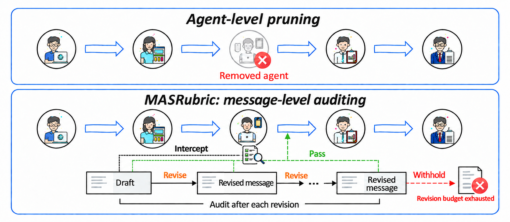
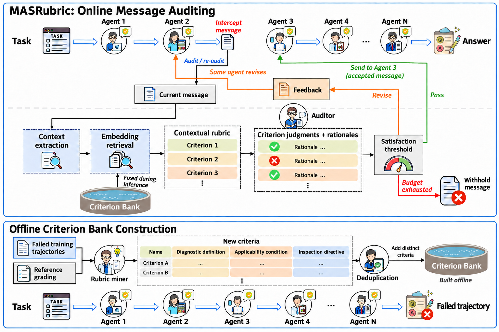

<p align="center">
  
</p>

<h1 align="center">MASRubric</h1>

<p align="center">
  <strong>Auditing Information Flow in Multi-Agent Systems<br>
  with Failure-Distilled Pitfall Rubrics</strong>
</p>

<p align="center">
  <a href="https://github.com/TonySY2/MASRubric/actions/workflows/tests.yml"></a>
</p>

<p align="center">
  <a href="https://arxiv.org/abs/2602.23258">Preprint (earlier title)</a> &nbsp;|&nbsp;
  <a href="docs/paper_main_reproduction.md">Runbook</a> &nbsp;|&nbsp;
  <a href="docs/experiment_matrix.md">Experiments</a> &nbsp;|&nbsp;
  <a href="#citation">Citation</a>
</p>

## Overview

MASRubric builds a bank of diagnostic criteria from failed multi-agent
trajectories, retrieves a contextual rubric for each intermediate message, and
decides whether to **Pass**, **Revise**, or **Withhold** it. A separate auditor
provides feedback; the reasoning agent revises its own output. Base models remain
frozen, and the criterion bank stays fixed during inference. Reference answers
are used for offline mining and benchmark grading, and are withheld from the
online auditor.

1. **Learn from failures.** Collect unsuccessful multi-agent trajectories and
   distill reusable diagnostic criteria into a compact bank.
2. **Retrieve a rubric.** Select criteria relevant to the current task and
   intermediate message.
3. **Audit before broadcast.** Pass accepted messages, request targeted revisions,
   and withhold messages that still fail after the revision budget.

<p align="center">
  
</p>

<p align="center"><em>From agent-level dropout to message-level auditing: retrieve a rubric, revise the message, and control what reaches downstream agents.</em></p>

<p align="center">
  
</p>

<p align="center"><em>MASRubric combines offline criterion-bank construction with online retrieval, auditing, and Pass / Revise / Withhold decisions.</em></p>

## Paper

The public preprint is available under the project's earlier title,
[**AgentDropoutV2: Optimizing Information Flow in Multi-Agent Systems via
Test-Time Rectify-or-Reject Pruning**](https://arxiv.org/abs/2602.23258).
Its latest posted version is v2, dated May 28, 2026. This repository now uses
the MASRubric name; the [citation](#citation) retains the preprint's title and
author metadata.

## Quick start

The commands below use **Python 3.10 and Bash on Linux or WSL2**. Model serving is
configured separately through OpenAI-compatible endpoints.

```bash
git clone https://github.com/TonySY2/MASRubric.git
cd MASRubric
python3.10 -m venv .venv-paper
source .venv-paper/bin/activate
python -m pip install -r paper/requirements.txt

# Inspect supported tasks and a command without making model calls.
python test/run_paper_main.py --list
python test/run_paper_main.py --suite math_8b --benchmark gsm8k --method masrubric --dry-run
```

Configure the four model roles. Replace the example hosts with your own services
and set each `*_KEY` to its key. `EMPTY` is only for a local service without
authentication.

```bash
export REASONING_URL=http://reasoning-host:8000/v1 REASONING_MODEL=Qwen3-8B
export SUPERVISOR_URL=http://auditor-host:8000/v1 SUPERVISOR_MODEL=Qwen3-8B
export SELECTOR_URL=http://selector-host:8000/v1 SELECTOR_MODEL=Qwen3.5-9B
export EMBEDDING_URL=http://embedding-host:8000/v1 EMBEDDING_MODEL=Qwen3-Embedding-8B
export REASONING_KEY=EMPTY SUPERVISOR_KEY=EMPTY SELECTOR_KEY=EMPTY EMBEDDING_KEY=EMPTY
```

Generate a cache for the bundled math criterion bank. This step calls the
embedding service; keep the same embedding model for subsequent experiments.

```bash
python test/metrics_pool/two_pool/embed_metrics-trigger.py \
  --input_file paper/assets/pools/math/deduped-mixed_metrics_two_pool.json \
  --output_cache_file paper/assets/pools/math/deduped-mixed_two_pool-trigger.jsonl

# Check local assets and dependencies, then run two questions.
python test/run_paper_main.py --suite math_8b --benchmark gsm8k --method masrubric --preflight
python test/run_paper_main.py --suite math_8b --benchmark gsm8k --method masrubric --limit 2
```

Remove `--limit` for the full benchmark. Use `--method baseline` for the baseline
on the same runtime. Alternative model roles require `--allow-model-override`.
See the [runbook](docs/paper_main_reproduction.md) for code tasks, the separate
OlympiadBench grader, external assets, and output interpretation.

## Repository contents

| Path | Purpose |
| --- | --- |
| `test/run_paper_main.py`, `configs/paper_main.json` | Reference Dynamic-MAS launcher and benchmark settings |
| `paper/runtime/`, `paper/assets/` | Reference runtime, evaluation data, and criterion banks |
| `test/run_release_experiment.py`, `configs/release_experiments.json` | Configurable dynamic/fixed experiments and intervention variants |
| `test/masrubric/` | Configurable runtime and per-call token accounting |
| `train/` | Offline failure collection and criterion-bank construction |
| `tests/` | Launcher, runtime, failure-handling, and accounting tests |

The reference launcher covers nine math tasks and four code tasks. The banks
contain 2,000 math criteria and 2,545 code criteria. Twelve evaluation datasets
are bundled; LiveCodeBench's matching 400-problem file and embedding caches must
be supplied or generated separately. Precomputed experiment outputs and result
tables are excluded; new runs write their own measurements.

## Additional experiments

```bash
python test/run_release_experiment.py --list
python test/run_release_experiment.py --benchmark gsm8k --method masrubric_math_main \
  --framework fixed --model-profile math_8b --limit 2 --dry-run
```

The [experiment matrix](docs/experiment_matrix.md) describes available presets,
environment variables, and custom banks. Its `--model-profile` option labels
outputs; endpoint variables select the actual models.

## Validation and scope

This release contains a recovered reference implementation with later
maintenance. Exact historical source identity and reproduction of every paper
result are not established. The configurable fixed DAG is an extension; it does
not establish equivalence with the paper's Fixed-MAS rows. Detailed behavior,
sampling differences, and supported comparisons are recorded in the
[runbook](docs/paper_main_reproduction.md#supported-scope-and-runtime-behavior).

Run the offline and local-fixture checks in the installed environment:

```bash
python -m unittest discover -s tests -p 'test_*.py'
```

Tests use local fixtures and do not establish model quality or benchmark scores.
Code benchmarks execute generated Python; use an isolated environment. Generated
results, logs, caches, and local credentials are ignored by Git. Review any
manually added outputs before sharing them, as they can contain prompts, paths,
and endpoint configuration.

## Citation

For the public preprint, use its arXiv citation:

```bibtex
@misc{wang2026agentdropoutv2optimizinginformationflow,
  title={AgentDropoutV2: Optimizing Information Flow in Multi-Agent Systems via Test-Time Rectify-or-Reject Pruning},
  author={Yutong Wang and Siyuan Xiong and Xuebo Liu and Wenkang Zhou and Liang Ding and Miao Zhang and Min Zhang},
  year={2026},
  eprint={2602.23258},
  archivePrefix={arXiv},
  primaryClass={cs.AI},
  url={https://arxiv.org/abs/2602.23258}
}
```

This codebase builds on [AgentDropout](https://github.com/wangzx1219/AgentDropout).
